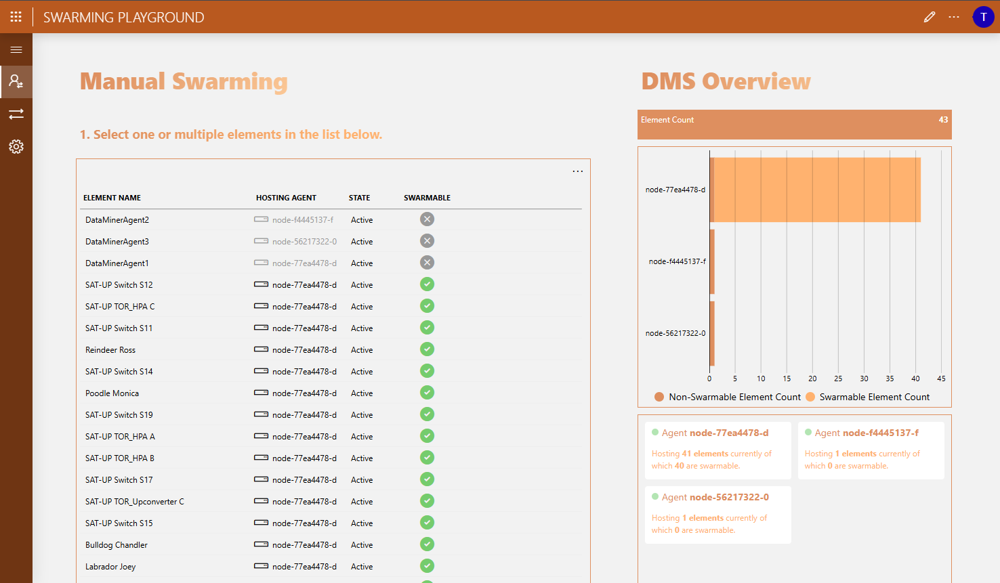
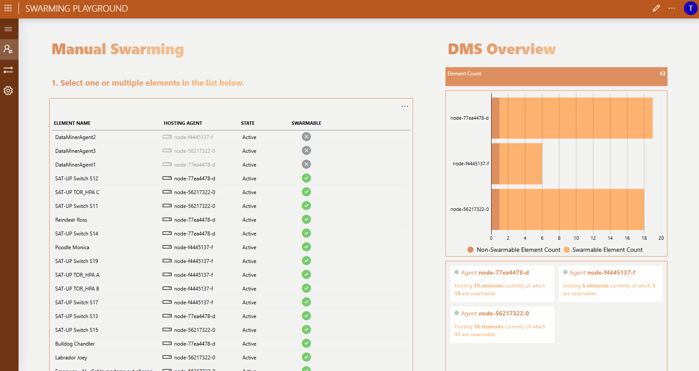
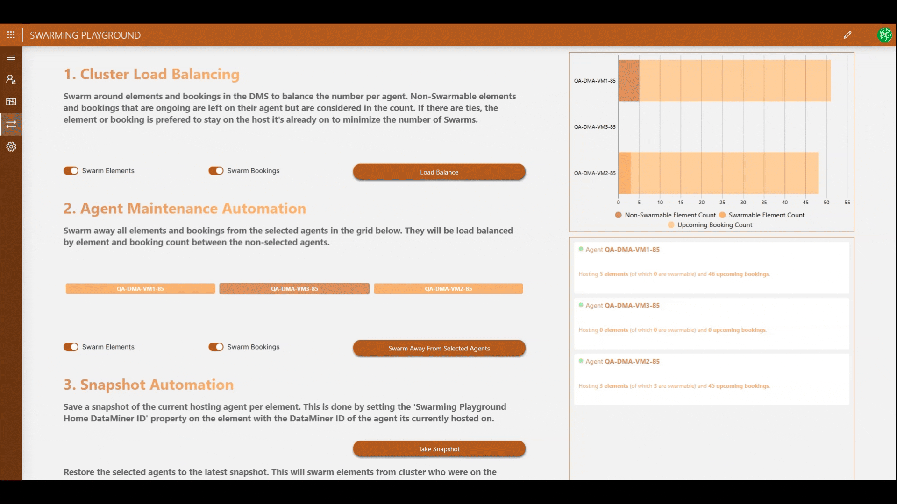
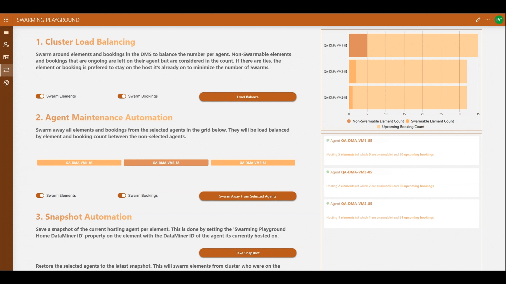
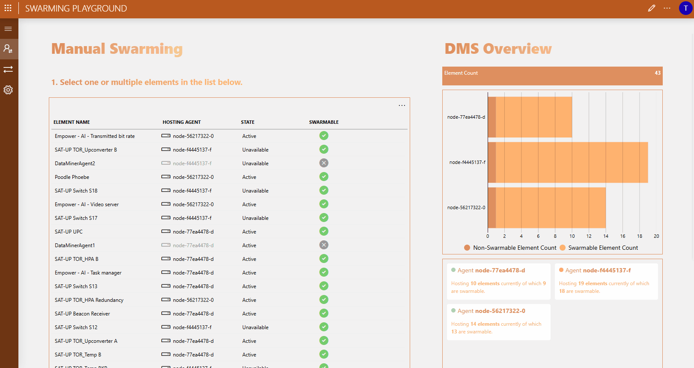

# Swarming Playground

## Overview

Sample application to play around with [Swarming](https://aka.dataminer.services/swarming).

Swarming allows you to move functionalities within your DMS from agent to another with minimal downtime.

## Key Features

* Ad hoc Swarming.
* Recover from critical agent failures.
* Load balancing.
* Swarming all functionality away from an agent to prepare for offline maintenance.

## Use cases

### Move functionality to a new host in the DMS

Move functionalities within your DMS from agent to another.

### Add new agent to the DMS and rebalance the cluster

Swarm functionality around so every agent more or less hosts the same amount.
Can be used to easily extend your system with an extra node and move functionalities from existing nodes to new nodes, so you can rebalance your cluster.

### Swarm away from an agent

Apply maintenance (e.g. Windows updates) on a live cluster, agent by agent, by temporarily moving functionalities away to other agents in the cluster.

> [!NOTE]
> Can not be used for DataMiner upgrades.

### Recover from a failing agent

Swarming makes it possible to recover functionalities from failing nodes by moving activities hosted on such a node to the remaining nodes.

## Prerequisites

To deploy this integration from the Catalog, you’ll need:

* DataMiner version 10.5.1/10.6.0
* A DataMiner System connected to dataminer.services.

To actually use this integration you will need to [enable swarming](https://aka.dataminer.services/enable-swarming) which comes with its own prerequisites.
