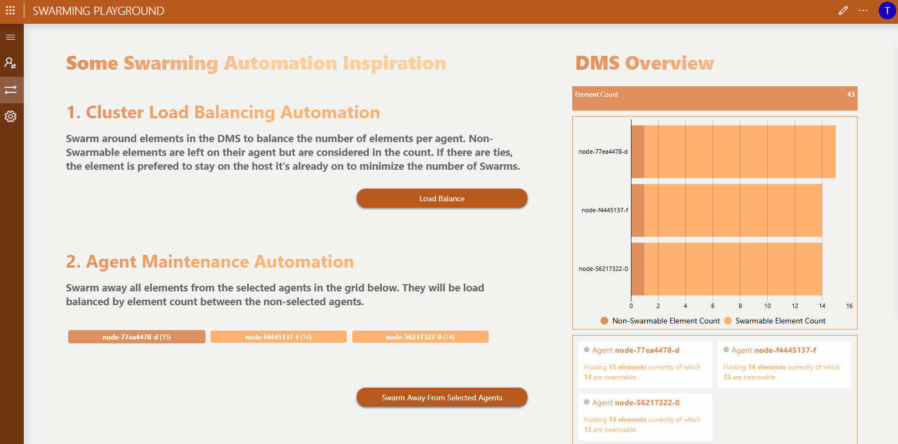

# Swarming Playground

## About

This is a sample application that will allow you to get acquainted with the concept of [Swarming](https://aka.dataminer.services/swarming).

Swarming allows you to move functionalities within your DMS from one agent to another with minimal downtime.

## Key Features

- Ad hoc Swarming
- Recover from critical agent failures
- Load balancing
- Swarming all functionality away from an agent to prepare for offline maintenance

## Use Cases

### Move functionality to a new host in the DMS

Move functionalities within your DMS from one agent to another.

### Add a new agent to the DMS and rebalance the cluster

Swarm functionality around so that every agent more or less hosts the same number of objects.

This can be used to easily extend your system with an extra node, and move functionalities from existing nodes to new nodes, allowing you to rebalance your cluster.

### Swarm away from an agent

Apply maintenance (e.g. Windows updates) on a live cluster, agent by agent, by temporarily moving functionalities away to other agents in the cluster.

> [!NOTE]
> This does not work for DataMiner upgrades.

### Recover from a failing agent

Swarming makes it possible to recover functionalities from failing nodes by moving activities hosted on such a node to the remaining nodes.

## Prerequisites

To deploy this sample application from the Catalog, you will need the following:

- DataMiner version 10.5.1+/10.6.0+
- A DataMiner System connected to dataminer.services.

To use this application you will need to [enable swarming](https://aka.dataminer.services/enable-swarming), which comes with its own set of prerequisites.
